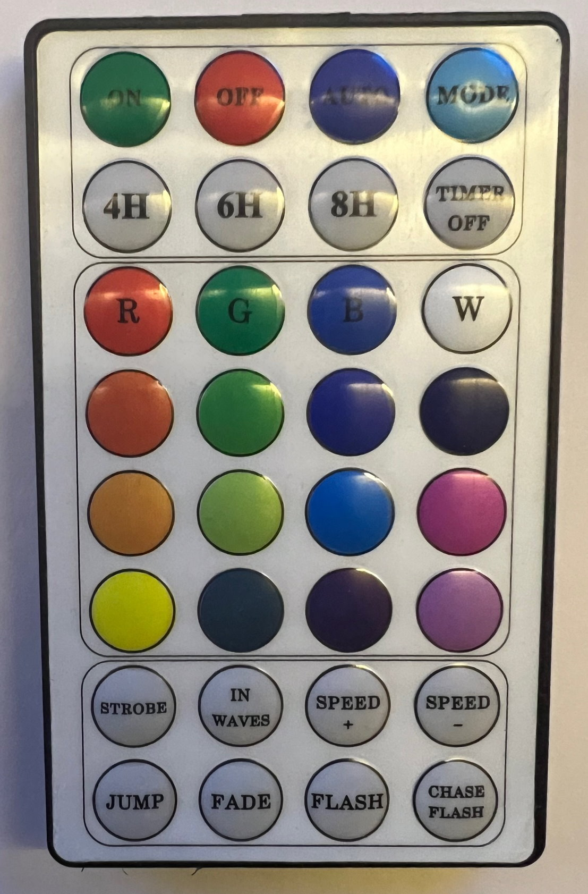
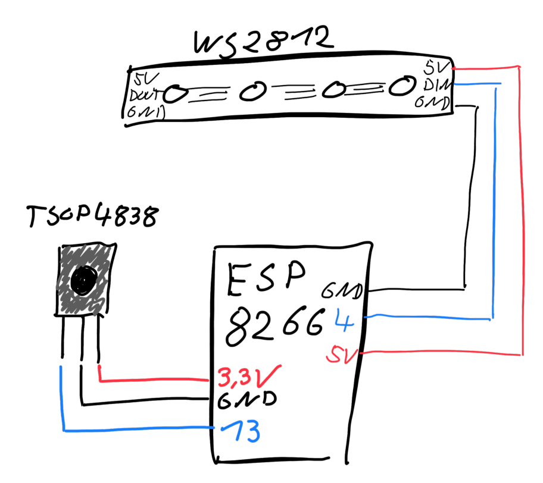
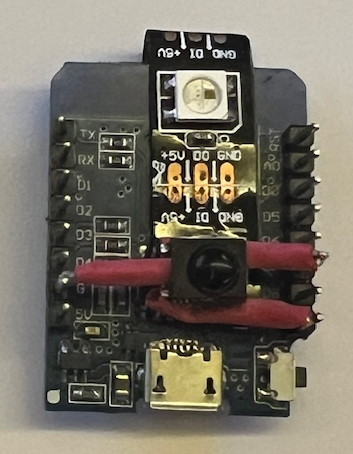
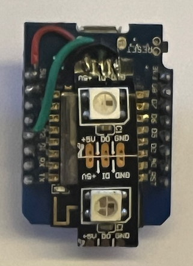

# ESP8266 and LEDs and RemoteControl with MicroPython

## My Goal

I got some of these remote controls and was challenged to get it working with some RGB LEDs. To make it a little more challenging I will try to use MicroPython even since I did not use Python before. 



## Hardware

I will use a random cheap ESP8266 dev board as a basis (e.g. NodeMcu).  

For receiving infrared signals a [TSOP4838](https://www.farnell.com/datasheets/30500.pdf) is just fine. 

For demo purpose I just added 4 [WS2812](https://cdn-shop.adafruit.com/datasheets/WS2812.pdf) LEDs fro m some LED stripe. 

### Connect it all together

Typical WS2812 LEDs need a 5V power supply. My board just provided 5V from USB at it's 5V pin. Other board don't do that, so that the 5V pin can only be used for powering the board. If you use such a board you have to provide the 5V currency from somewhere else. I connected the data pin of the WS2812 to pin 4.

The TSOP4838 works fine with 3.3V power supply. Just connect it to the 3.3V and GND and the data pin to any I/O PIN of the board. I used pin 13.

Most boards have two different schemes to number the pins one are the numbers printed on the board and the other are the numbers used by the ESP8266 itself. For coding here you need the latter. In my case pin 4 is called D2 and pin 13 is called D7. Makes sense, doesn't it?







## Software

 1. Install MicroPython on your board as described at https://micropython.org/ 
     - I used ESP8266_GENERIC-20230426-v1.20.0.bin
     - You could connect your board to WiFi but no need for that.
     - You can connect a serial terminal using 115200 baud.
 2. I use VisuaStudio Code with Pymakr extension to connect to the board using USB and access the filesystem of the board
 3. Install the `ir_rx` library from https://github.com/peterhinch/micropython_ir - you need to copy the whole ir_rx folder to the board.
 
### Run ir_rx testscripts

Connect the board with your computer and connect to the serial port (115200 baud) then see https://github.com/peterhinch/micropython_ir/blob/master/RECEIVER.md#21-test-scripts for detailed instructions.

```
>>> from ir_rx.test import test
Test for IR receiver. Run:
from ir_rx.test import test
test() for NEC 8 bit protocol,
test(1) for NEC 16 bit,
test(2) for Sony SIRC 12 bit,
test(3) for Sony SIRC 15 bit,
test(4) for Sony SIRC 20 bit,
test(5) for Philips RC-5 protocol,
test(6) for RC6 mode 0.
test(7) for Microsoft Vista MCE.
test(8) for Samsung.
```
 
and then

```
>>> test()
```

Now every received ir command is reported like 

```
Data 0x16 Addr 0x0000 Ctrl 0x00
Repeat code.
Data 0x4c Addr 0x0000 Ctrl 0x00
Repeat code.
Data 0x1e Addr 0x0000 Ctrl 0x00
Repeat code.
```

For different remote controls you have to probe for the right protocol. NEC 8 bit (witch is used by `test()` without further parameters) is very common for cheap controls like mine.

### Collecting the map of my remote control

Have a look at the photo above and the table below:

```
0x10	0x03	0x01	0x06
0x09	0x1d	0x1f	0x0d

0x19	0x1b	0x11	0x15
0x17	0x12	0x16	0x4d
0x40	0x4c	0x04	0x00
0x0a	0x1e	0x0e	0x1a

0x1c	0x14	0x0f	0x0c
0x02	0x48	0x54	0x05
```

E.g. the Button ON uses the code 0x10 and "CHASE FLASH" the code 0x05.

### Control the LEDs

Again: first try it in the console. The MicroPython image I flashed on my board comes with the [NeoPixel](https://docs.micropython.org/en/latest/esp8266/tutorial/neopixel.html) library to control such LEDs.

```
>>> from machine import Pin
>>> from neopixel import NeoPixel
>>> pin = Pin(4, Pin.OUT)
>>> leds = NeoPixel(pin, 4)
>>> leds[0] = (20,0,0)
>>> leds.write()
```

Now the first LED became red. 

### Putting it all together

See `main.py` where i hacked some code, to control all LEDs using some of the remote control buttons. just for fun.